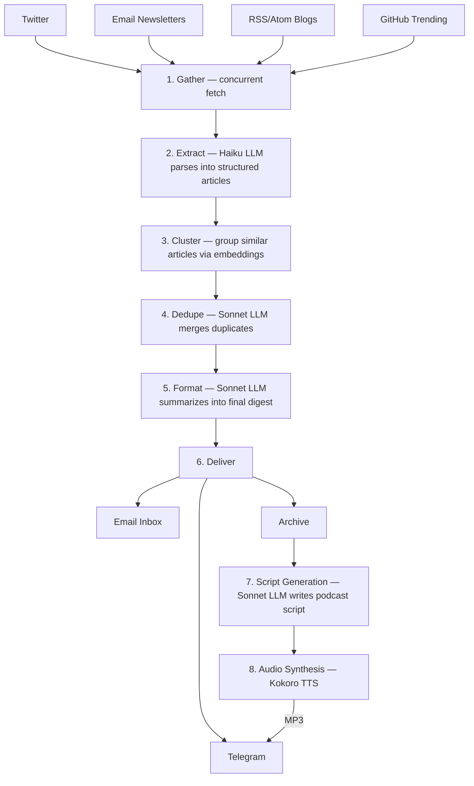

# Digest Pipeline

Automated news aggregation and podcast generation. Orginally created to produce a daily summary of AI related news, but it can be used to create a digest for any topic you are interested in. You specify the sources you want to be scanned. They can be:
- twitter accounts
- RSS/Atom blogs
- Emailed newsletters you receive
- Trending github repositories

Fetches content from all the sources, deduplicates with LLM-powered clustering, and delivers a formatted daily digest with links back to the source(s). You can even generate your own personal AI-generated podcast based on generated digest so that you can listen to it instead of reading it!

Final delivery of the digest and the podcast can be to your email inbox or telegram.

## How it works



**Six-stage digest pipeline:**

1. **Gather** — Concurrent fetch from Twitter (via `bird` CLI), email newsletters (via IMAP), blog RSS/Atom feeds, and GitHub trending repos
2. **Extract** — Batched Haiku LLM calls parse raw content into structured articles with title, category, description, URL, and source
3. **Cluster** — Groups similar articles using `text-embedding-3-small` embeddings and centroid-based cosine similarity (threshold 0.85)
4. **Dedupe** — Single Sonnet call merges articles within each cluster into canonical items
5. **Format** — Single Sonnet call summarizes and organizes by category into final markdown
6. **Deliver** — Email (Gmail/SMTP/AgentMail), notifications (Telegram/Slack), and local archive

**Podcast pipeline** (optional, runs after digest):

1. **Script generation** — Sonnet writes a two-host conversational script from the digest
2. **Audio synthesis** — TTS via Kokoro-82M (local, zero-cost)
3. **Delivery** — Sends MP3 via Telegram

## Installation

Requires Python 3.11+.

```bash
# Quick setup (creates venv, installs deps, checks for system tools)
./setup.sh

# Or manually:
python3 -m venv .venv
source .venv/bin/activate
pip install -e .
```

### External tools

The pipeline shells out to a few CLI tools depending on your configured sources:

| Tool | Used for | Install |
|------|----------|---------|
| `bird` | Twitter/X fetching | [github.com/nichochar/bird](https://github.com/nichochar/bird) |
| `curl` | Blog RSS/Atom feeds | Pre-installed on most systems |
| `ffmpeg` | WAV-to-MP3 conversion | `apt install ffmpeg` / `brew install ffmpeg` |

## Usage

```bash
# Full pipeline (digest + podcast)
digest-pipeline /path/to/config.json

# Dry run — skips delivery, prints digest to stdout
digest-pipeline /path/to/config.json --dry-run

# Digest only (skip podcast)
digest-pipeline /path/to/config.json --digest-only

# Podcast only (requires a previously archived digest)
digest-pipeline /path/to/config.json --podcast-only

# Run as Python module
python -m digest_pipeline.digest --config config.json --dry-run
```

## Configuration

All configuration lives in a single JSON file. The config file's parent directory becomes the `data_root` where archives, logs, and secrets are stored.

```json
{
  "digest": {
    "name": "My Daily Digest",
    "emoji": "📰",
    "tagline": "DAILY DIGEST",
    "tone": "concise and informative"
  },
  "sources": {
    "twitter": {
      "accounts": ["@elonmusk", "@sama"]
    },
    "newsletters": {
      "imap": {
        "host": "imap.gmail.com",
        "email": "you@gmail.com"
      },
      "sources": {
        "tldr": { "name": "TLDR", "from": "dan@tldrnewsletter.com", "lookback_days": 1 }
      }
    },
    "blogs": {
      "hacker_news": { "url": "https://hnrss.org/frontpage", "type": "rss" }
    },
    "github": {
      "enabled": true,
      "languages": ["python", "typescript"],
      "since": "daily"
    }
  },
  "categories": [
    { "id": "ai", "label": "AI & ML", "emoji": "🤖", "description": "AI/ML breakthroughs" },
    { "id": "dev", "label": "Dev Tools", "emoji": "🛠️", "description": "Developer tools and frameworks" }
  ],
  "delivery": {
    "email": {
      "method": "smtp",
      "to": "you@example.com",
      "from": "digest@example.com"
    },
    "telegram": {
      "chat_id": "-100123456789"
    }
  },
  "podcast": {
    "enabled": true,
    "name": "Daily Brief",
    "tts_backend": "kokoro",
    "hosts": [
      { "tag": "ALEX", "role": "Main host", "voice_kokoro": "am_michael" },
      { "tag": "SARAH", "role": "Co-host", "voice_kokoro": "af_heart" }
    ]
  },
  "llm": {
    "provider": "openrouter"
  }
}
```

### Secrets

API keys and passwords are loaded from a `secrets.env` file at the repository root (the `digest_pipeline/` package's parent directory). Environment variables that are already set take precedence.

```env
# For newsletter fetching (Gmail: use an App Password)
IMAP_PASSWORD=xxxx-xxxx-xxxx-xxxx

# For Twitter fetching
AUTH_TOKEN=...
CT0=...
```

## Management Console

A read-only web dashboard for monitoring all your digests in one place. See which sources are healthy, track run history, monitor delivery success rates, and check podcast status — no log-diving required.

**Views:**

- **Overview** — All digests at a glance with last run status, article counts, and subscriber numbers
- **Run History** — Recent runs with status, duration, cost, and article counts. Click into any run for details.
- **Run Detail** — Article funnel showing how content flows through the pipeline (extracted > clustered > deduped > prioritized > formatted), per-stage timeline with token usage and costs, and per-source file breakdown
- **Source Health** — Sources grouped by type (Twitter, blogs, newsletters, GitHub) with health indicators flagging stale or inactive sources
- **Delivery** — Subscriber count, 7-day delivery success rate, send history by date, and individual send log
- **Podcast** — Episode list with MP3/script availability, file sizes, and RSS feed sync status

```bash
# Start the console
digest-pipeline --console

# With options
digest-pipeline --console --host 0.0.0.0 --port 5200 --digests-dir /path/to/digests

# Defaults: host=127.0.0.1, port=5200, digests-dir auto-discovered
```

The console reads existing pipeline artifacts (run logs, stage outputs, delivery history) — no additional configuration or instrumentation needed. Built with Preact and Material Web.

## Project structure

```
digest_pipeline/
  cli.py               # CLI entry point
  digest.py            # Main orchestrator, batching logic
  gather.py            # Source-specific fetchers (Twitter, Gmail, RSS, GitHub)
  llm.py               # OpenRouter/Anthropic API client, embeddings, cost tracking
  cluster.py           # Embedding-based cosine similarity clustering
  delivery.py          # Email, Telegram/Slack notifications, archiving
  podcast.py           # Script generation + TTS synthesis
  kokoro_tts.py        # Kokoro-82M local TTS (streaming, memory-efficient)
  subscription_api.py  # Flask subscription API (public-facing)
  console_api.py       # Flask management console API (internal)
  config.py            # Config loading, prompt templating
  log.py               # File + console logging, 30-day auto-cleanup
  prompts/             # LLM prompt templates with {{variable}} placeholders
console/               # Preact + Vite frontend for the management console
```

## Key design decisions

- **No ML frameworks for clustering** — Pure Python cosine similarity with running centroid averages. No sklearn/scipy needed.
- **Batched LLM calls** — Sources are batched by character count (max 200K chars/batch, ~50K tokens) to stay within context limits while minimizing API calls.
- **Streaming TTS** — Kokoro backend writes audio incrementally to disk to avoid accumulating all samples in memory (important for low-RAM servers).
- **Config-driven** — Categories, sources, delivery methods, hosts, and voices are all configurable via JSON. No code changes needed to customize.

## License

MIT
