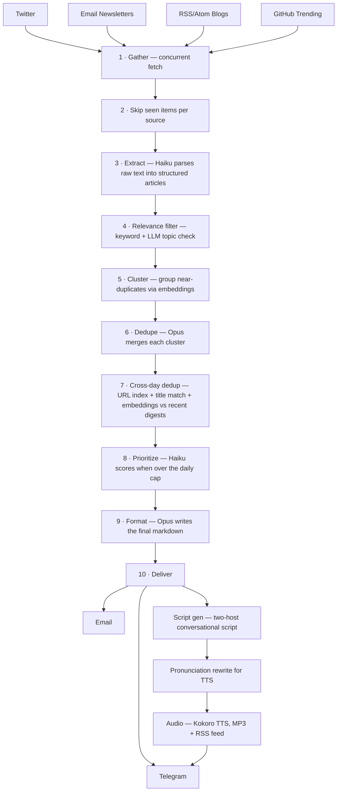

# Digest Pipeline

Automated news aggregation and podcast generation. Originally built to produce a daily summary of AI news, but it can run a digest on any topic. You point it at the sources you care about — Twitter accounts, RSS/Atom blogs, emailed newsletters, trending GitHub repos — and it returns a deduplicated, summarized daily briefing delivered to your inbox or Telegram. Optionally, two AI hosts will read the digest to you as a podcast.

You can run a single digest, or several digests side by side (one per topic), each with its own sources, subscribers, and podcast feed.

## How it works



**The digest pipeline:**

1. **Gather** — concurrent fetch from Twitter (via the `bird` CLI), newsletters (IMAP), blog RSS/Atom feeds, raw HTML pages, and GitHub trending. Output is one raw text file per source.
2. **Skip-seen filter** — per-source state in `.source_state.json` records which tweet/post/email IDs were already processed. Already-seen items are stripped before extraction so the LLM never re-reads them.
3. **Extract** — batched Haiku calls (max ~200K chars per batch) parse raw content into `{title, category, description, url, source}` records.
4. **Relevance filter** *(optional)* — `keywords_include` keep, `keywords_exclude` drop, and a cheap Haiku classifier decides borderline cases. Off-topic articles are written to `work/<date>/filtered.json` for inspection.
5. **Cluster** — articles are embedded with `text-embedding-3-small` and grouped via streaming cosine similarity (centroid threshold 0.85). Pure Python, no sklearn.
6. **Dedupe** — one Opus call per run merges each cluster into a canonical article (provenance matched by echoed group id).
7. **Cross-day dedup** — three layered gates: a global canonical-URL index of everything shipped in the last 14 days (`.shipped_urls.json`), normalized-title similarity, and embedding cosine similarity against a rolling 5-day window of `.seen_embeddings.json` — plus an optional LLM adjudication of the grey zone. Anything that already shipped recently is dropped, and the skipped set is written to `work/<date>/cross_skipped.json`.
8. **Prioritize** *(only if over `digest.max_articles`)* — Haiku scores each article. The selector guarantees at least one article per category, then fills the rest by score.
9. **Format** — one Opus call writes the final markdown digest, organized by category, in your configured tone.
10. **Deliver** — sends the digest by email and/or Telegram, then archives the rendered markdown to `<data_root>/<date>.md`.

**Podcast pipeline** *(optional, runs after the digest)*:

1. **Script generation** — Opus writes a conversational script for two hosts.
2. **Pronunciation rewrite** — non-destructive substitutions (terms + regex from config) are applied to the script before TTS so the audio sounds right without polluting the transcript.
3. **Audio synthesis** — local Kokoro-82M TTS streams audio to disk; `ffmpeg` encodes MP3.
4. **Publish** — the MP3 is sent to Telegram, `podcast.xml` is regenerated for podcast-app subscriptions, and the digest's `index.html` landing page is updated.

## Installation

Requires Python 3.11+.

```bash
# One-shot setup: creates .venv, installs the package, prompts for system deps
./setup.sh

# Or manually
python3 -m venv .venv
source .venv/bin/activate
pip install -e .

# For tests
pip install -e ".[dev]"
```

### External tools

The pipeline shells out to a few CLI tools. You only need the ones for the source types you use.

| Tool | Used for | Install |
|------|----------|---------|
| `bird` | Twitter/X fetching | [github.com/nichochar/bird](https://github.com/nichochar/bird) |
| `curl` | HTTP fetches (RSS, HTML, GitHub) | pre-installed on most systems |
| `ffmpeg` | WAV → MP3 for the podcast | `apt install ffmpeg` / `brew install ffmpeg` |

## Quick start

```bash
# Interactive wizard: creates digests/<your-slug>/ with config.json,
# a starter landing page, and an empty subscribers list.
digest-pipeline init

# Then run it
digest-pipeline digests/<your-slug>/config.json --dry-run    # preview, no delivery
digest-pipeline digests/<your-slug>/config.json              # full run
```

The wizard prompts for digest name, tagline, categories, podcast hosts (and TTS voices), and your delivery channels. It writes a self-contained `digests/<slug>/` directory that you can edit by hand later.

## Usage

The `digest-pipeline` command does several jobs depending on flags. The first non-flag argument is always the path to a digest config.

### Run a digest

```bash
digest-pipeline digests/ai/config.json                 # digest + podcast
digest-pipeline digests/ai/config.json --dry-run       # log what would happen, send nothing
digest-pipeline digests/ai/config.json --digest-only   # skip the podcast
digest-pipeline digests/ai/config.json --podcast-only  # regenerate audio from an archived digest
```

### Manage subscribers

```bash
digest-pipeline digests/ai/config.json --subscribe alice@example.com
digest-pipeline digests/ai/config.json --unsubscribe alice@example.com
digest-pipeline digests/ai/config.json --list-subscribers
```

### Run the servers

```bash
# Public subscription API (POST /api/subscribe, /api/unsubscribe, GET /unsubscribe page)
digest-pipeline --serve                                # auto-discovers digests/
digest-pipeline --serve --digests-dir /path/to/digests --port 5100
digest-pipeline digests/ai/config.json --serve         # single-digest mode

# Read-only management dashboard
digest-pipeline --console
digest-pipeline --console --host 0.0.0.0 --port 5200 --digests-dir /path/to/digests
```

### Maintenance

```bash
# Backfill .seen_embeddings.json from your archived YYYY-MM-DD.md files,
# then simulate what the cross-day dedup would have skipped.
digest-pipeline digests/ai/config.json --backfill

# Recompute podcast subscriber + download counts from access logs.
digest-pipeline --podcast-stats
digest-pipeline digests/ai/config.json --podcast-stats

# Audit configured sources and push a Telegram report of stale/unhealthy ones.
# When the digest has a sources.twitter.discovery block, the report also
# appends suggested new popular AI Twitter accounts to add.
digest-pipeline --audit-sources --digest ai
digest-pipeline --audit-sources --digest ai --dry-run

# Run Twitter account discovery on its own (no audit). Searches the
# configured keywords via the bird CLI, ranks candidates by a composite
# of follower count, posting frequency, and engagement, and filters out
# accounts already in sources.twitter.accounts.
digest-pipeline --discover-twitter --digest ai
digest-pipeline --discover-twitter --digest ai --dry-run

# Same as above, but emit the report as JSON on stdout (logs → stderr).
# Used internally by the /discover-twitter slash command.
digest-pipeline --discover-twitter --digest ai --json

# Append one or more handles to digests/<slug>/config.json atomically.
# Case-insensitive against the existing accounts list, strips a leading @.
digest-pipeline --add-twitter-account swyx LangChainAI --digest ai
digest-pipeline --add-twitter-account swyx --digest ai --dry-run
```

Configuration for discovery lives under `sources.twitter.discovery` in
each digest's `config.json` — set `enabled: false` (or omit the block) to
skip discovery for that digest. Tunable fields: `keywords`,
`tweets_per_keyword`, `min_followers`, `min_posts_per_week`, `top_n`,
`score_weights`. Requires the same `AUTH_TOKEN` / `CT0` cookies the
Twitter fetcher already uses.

**Interactive pick-and-add via Claude Code:** `/discover-twitter <slug>`
runs the discovery, prints a numbered list with bio, LLM rationale, and
sample tweets, then lets you pick by number (`1,3,5` / `all` / `none`)
and applies the additions in one atomic write. The slash command lives
at `.claude/commands/discover-twitter.md` and wraps the same two CLI
flags above.

## Configuration

Each digest is a single JSON file. The directory containing the config becomes its **data root** — every artifact (archives, podcasts, subscriber list, embeddings cache, work files, logs) lives next to the config. The wizard creates this layout for you.

Top-level structure:

```json
{
  "digest":           { "name": "...", "tagline": "...", "tone": "...", "max_articles": 30 },
  "categories":       [ { "id": "ai", "label": "AI & ML", "emoji": "🤖", "description": "..." } ],
  "sources":          { "twitter": {...}, "newsletters": {...}, "blogs": {...}, "github_trending": {...} },
  "relevance_filter": { "enabled": true, "topic": "...", "keywords_include": [...], "keywords_exclude": [...], "borderline_llm": true },
  "podcast":          { "enabled": true, "name": "...", "hosts": [...], "tts_backend": "kokoro", "pronunciation": {...} },
  "delivery":         { "email": {...}, "notify": { "telegram": {...} } },
  "subscriptions":    { "public_base_url": "...", "cors_origins": [...], "port": 5100 },
  "llm":              { "provider": "openrouter", "models": { "format": "opus" } },
  "clustering":       { "cross_day_threshold": 0.80, "title_match_threshold": 0.6, "grey_zone_llm": true }
}
```

A complete real-world example lives at [digests/ai/config.json](digests/ai/config.json). What each section does:

- **`digest`** — display name, emoji, tagline, tone instruction passed to the formatter, and `max_articles` (the cap that triggers the prioritize stage).
- **`categories`** — IDs and labels used by the extract/format prompts to bucket articles. Add your own; they're injected into the prompt templates at run time.
- **`sources`** —
  - `twitter`: list of `accounts`, plus `lookback` and `max_per_account`.
  - `newsletters`: an `imap` block (host, email; password from env) and a `sources` map of named senders with `from`/`lookback_days` filters.
  - `blogs`: a map of named feeds with `feed_url` (RSS/Atom), or `url` + custom HTML parsers for non-feed sites.
  - `github_trending`: filters by `min_stars_week` and `ai_keywords` for the README scan.
- **`relevance_filter`** — optional pre-cluster filter. Keyword rules first, optional LLM tiebreaker for borderline cases.
- **`podcast`** — episode metadata, `hosts` array (each with `tag`, `role`, and a `voice_kokoro` voice id), and `pronunciation` rules (terms map + regex list) applied right before TTS.
- **`delivery`** —
  - `email`: backend (`smtp`, `gog`, `agentmail`, or `resend`), to/from addresses, env-var keys for credentials.
  - `notify.telegram`: chat id (or env-var name) for status pings and audio delivery.
- **`subscriptions`** — public base URL (used in unsubscribe links), allowed CORS origins, and the port the `--serve` API binds to.
- **`llm`** — `provider` picks `openrouter` or `anthropic` (both supported by the same client). Optional `models` maps a pipeline stage to a model tier or full model id, e.g. `{"format": "sonnet"}` — defaults run the writing stages (`dedupe`, `format`, `podcast`) on Claude Opus 5 and everything else (`extract`, `relevance`, `prioritize`, `title`, `discovery`, `same_story`) on Haiku 4.5.
- **`clustering`** *(optional)* — dedup tuning: `intra_day_threshold` (default 0.85), `cross_day_threshold` (0.80), `cross_day_lookback_days` (5), `title_match_threshold` (0.6), `url_lookback_days` (14), and `grey_zone_llm`/`grey_zone_low` for the optional LLM same-story check on the 0.70–0.85 similarity band.

### Staging overlays

Set `DIGEST_ENV=staging` and the loader will deep-merge a sibling `config.staging.json` (or any other `config.<env>.json`) on top of the base. Useful for non-prod deployments that need only a few overrides — public URL, port, telegram chat id, etc. Overlay files are gitignored.

```bash
DIGEST_ENV=staging digest-pipeline digests/ai/config.json
```

### Parallel staging comparison

To evaluate a branch before cutting prod over, run staging as a daily prod-parallel and let `scripts/compare_digests.py` diff the two outputs.

One-time setup in the staging checkout:

```bash
cd ~/digest-pipeline-staging
git fetch origin && git checkout <branch>
# Seed cross-day dedup state (embeddings + shipped-URL index) from the
# archived digests so staging isn't handicapped by a cold start:
DIGEST_ENV=staging .venv/bin/digest-pipeline digests/ai/config.json --backfill
```

Then add two cron lines next to the prod one (prod fires 3:00 AM ET; adjust to taste):

```cron
# staging parallel run, 5 min after prod's slot
5 3 * * *  cd ~/digest-pipeline-staging && DIGEST_ENV=staging bash run.sh digests/ai/config.json >> logs/cron.log 2>&1
# daily comparison ~90 min later: Telegram summary + full report on disk
30 4 * * * cd ~/digest-pipeline-staging && DIGEST_ENV=staging .venv/bin/python3 scripts/compare_digests.py ~/digest-pipeline/digests/ai digests/ai --llm-judge --notify digests/ai/config.json >> logs/compare.log 2>&1
```

Each day this writes `compare-<date>.md` into the staging data root (article diff with suppression reasons, repeat-stories-shipped per side, cost/stage table, blind LLM quality judgment) and pings Telegram with the headline numbers. `--days N` produces a rollup across the run. Staging emails go to the isolated staging subscriber list, so received-email quality can be compared directly. Remove the two cron lines at cutover.

### Secrets

API keys and passwords are loaded from a `secrets.env` file at the repo root (gitignored). Already-set environment variables take precedence.

| Variable | Needed when |
|----------|-------------|
| `OPENROUTER_API_KEY` | `llm.provider = "openrouter"` (also used for embeddings) |
| `ANTHROPIC_API_KEY` | `llm.provider = "anthropic"` |
| `IMAP_PASSWORD` | newsletter source is configured (Gmail: use an App Password) |
| `AUTH_TOKEN`, `CT0` | Twitter source is configured (passed to the `bird` CLI) |
| `RESEND_API_KEY` | email backend is `resend` |
| `TELEGRAM_BOT_TOKEN` | Telegram delivery is configured |
| `TELEGRAM_CHAT_ID` | Telegram delivery is configured |

Config can override the env var **name** for any of the above (e.g., `chat_id_env: "TELEGRAM_CHAT_ID_STAGING"`), which is how the staging overlay points at a different chat without leaking the value into the JSON.

## Data layout

Each digest's directory holds both source-of-truth files (committed to git) and runtime working files (gitignored).

```
digests/<slug>/
├── config.json                 # digest configuration
├── index.html                  # public landing page (subscribe form, podcast feed link)
├── 2026-04-23.md               # archived daily digest (gitignored)
├── podcast.xml                 # RSS feed for podcast apps
├── podcasts/
│   ├── 2026-04-23.mp3          # episode audio
│   └── 2026-04-23.txt          # script transcript
├── subscribers.json            # subscriber list (gitignored)
├── subscription_events.jsonl   # subscribe/unsubscribe audit log
├── send_history.jsonl          # per-recipient delivery log
├── work/<date>/                # intermediate artifacts: extracted.json, clusters.json, deduped.json, run.json, raw-*.txt
├── logs/                       # daily log files (auto-cleaned after 30 days)
├── .seen_embeddings.json       # rolling cross-day dedup cache
├── .shipped_urls.json          # global canonical-URL index of shipped articles
└── .source_state.json          # per-source incremental cursor
```

Everything except `config.json` is a runtime artifact and gitignored — the daily markdown, MP3, transcript, RSS feed, landing page, subscriber list, audit logs, work files, and dotfile caches all live on disk next to the config but are never committed.

## Management Console

A read-only web dashboard for monitoring all your digests in one place. Reads the same artifacts the pipeline writes — no extra instrumentation.

**Views:**

- **Overview** — every digest at a glance: last run status, article count, source count, subscribers
- **Run history** — recent runs with status, duration, total LLM cost, and article counts
- **Run detail** — funnel through the pipeline (extracted → clustered → deduped → prioritized → formatted), per-stage timeline with tokens/cost, per-source file breakdown
- **Source health** — sources grouped by type with health flags (healthy / warning / stale), yield rate, and exclusive-article counts
- **Source editor** — add, edit, or delete sources from a digest's config from the dashboard (writes back to `config.json` atomically)
- **Delivery** — subscriber count, 7-day success rate, send history by date, per-recipient log
- **Podcast** — episodes with MP3/script status, RSS feed sync check, and (if `--podcast-stats` has been run) estimated subscribers and per-episode downloads

```bash
digest-pipeline --console
# Defaults: host=127.0.0.1, port=5200, digests-dir auto-discovered from ./digests/
```

The frontend is a Preact + Material Web SPA in [console/](console/), bundled with Vite. `npm run build` outputs to `console/dist/` which the Flask app serves directly.

### Frontend development

For hot-reload work on the dashboard, run the Flask API and the Vite dev server side by side. Vite proxies `/api/*` to Flask, so the SPA can call the real backend while you iterate on the UI.

```bash
# Terminal 1 — Flask API
digest-pipeline --console --port 5200

# Terminal 2 — Vite dev server (hot reload)
cd console && npm run dev

# Production build (outputs to console/dist/, served by Flask)
cd console && npm run build
```

## Subscription API

A small Flask app that powers the subscribe form on each digest's landing page and handles one-click unsubscribe links in emails (including the Gmail `List-Unsubscribe` header).

- `POST /api/subscribe` — adds an email to a digest. Honeypot fields, sliding-window rate limit (5/min/IP), and a constant-success response so the endpoint can't be used to enumerate subscribers.
- `POST /api/unsubscribe` and `GET /unsubscribe?token=…` — token-based unsubscribe with a confirmation page.
- `GET /health` — list of active digest slugs.

Multiple digests are served from one process. The frontend or reverse proxy picks which digest the request is for via an `X-Digest: <slug>` header or a `?digest=<slug>` query parameter.

```bash
digest-pipeline --serve                  # auto-discovers digests/
digest-pipeline --serve --port 5100
```

## Deployment

Notes from the reference deployment on a small Hetzner VPS (`ubuntu-2gb-ash-1`). Everything runs as the `clawdbot` user behind Caddy, with daily runs driven by cron.

**Services:**

- **Subscription API** — systemd unit `digest-subscriptions.service`, listens on `127.0.0.1:5100`, fronted by Caddy with automatic Let's Encrypt TLS.
- **Management Console** — systemd unit `digest-console.service`, listens on `100.95.155.14:5200` (Tailscale-only, no public exposure, no auth needed).
- **Daily run** — cron entry that calls `run.sh` once per day.

**Caddy:** `/etc/caddy/Caddyfile`. Each digest's public hostname (e.g. `aidailyroundup.com`, `staging.aidailyroundup.com`) is a vhost that reverse-proxies `/api/*` to the subscription API and serves the static landing page. Caddy is bound to a specific public IP rather than `0.0.0.0` to avoid colliding with Tailscale on `:443`.

**Entry point:** systemd units must invoke `.venv/bin/digest-pipeline` (the installed console script). `python -m digest_pipeline.cli` will not work — the package has no `__main__.py`.

**DNS:** `ai-digest.duckdns.org` is a free DuckDNS record pointing at the VPS public IP, used for the subscription API's TLS hostname.

```bash
# Subscription API
sudo systemctl status digest-subscriptions
sudo systemctl restart digest-subscriptions
sudo journalctl -u digest-subscriptions --no-pager -n 30

# Management Console
sudo systemctl status digest-console
sudo systemctl restart digest-console
sudo journalctl -u digest-console --no-pager -n 30

# Caddy
sudo systemctl status caddy
sudo systemctl reload caddy
sudo journalctl -u caddy --no-pager -n 30
```

## Project structure

```
digest_pipeline/
  cli.py               # single CLI entry point — dispatches to all commands above

  # Pipeline core
  digest.py            # orchestrator: stages 1-10, batching, token tracking
  gather.py            # source-specific fetchers (Twitter, IMAP, RSS/HTML, GitHub trending)
  llm.py               # OpenRouter/Anthropic client, embeddings, extract/dedupe/prioritize/format calls, cost tracking
  cluster.py           # streaming cosine-similarity clustering
  relevance.py         # keyword + LLM topic filter (stage 4)
  source_state.py      # per-source incremental cursor (stage 2)
  seen_articles.py     # cross-day dedup via rolling embeddings (stage 7)

  # Podcast
  podcast.py           # script generation + audio orchestration + RSS/landing-page update
  pronunciation.py     # non-destructive term/regex rewrites applied before TTS
  kokoro_tts.py        # Kokoro-82M local TTS (streams to disk, ffmpeg-encoded MP3)
  podcast_stats.py     # subscriber + download analytics from access logs

  # Delivery
  delivery.py          # email (SMTP / Resend / AgentMail / GOG), Telegram, Slack, audio send
  subscribers.py       # subscriber CRUD with atomic writes, JSONL audit logs

  # Servers
  subscription_api.py  # Flask: public subscribe/unsubscribe, multi-digest routing
  console_api.py       # Flask: read-only dashboard API + source editor + static SPA host

  # Plumbing
  config.py            # config loader, DIGEST_ENV staging overlay, prompt templating, voice mapping
  log.py               # per-date file + console logger (30-day cleanup)
  run_log.py           # writes structured run.json per pipeline run for the dashboard
  init.py              # `digest-pipeline init` interactive wizard
  prompts/             # LLM prompt templates: extract_normalize, relevance_check, dedupe, prioritize, summarize_format, podcast_script
  templates/           # landing_page.html template used by the wizard

console/               # Preact + Material Web + Vite frontend for the management console
digests/               # one subdirectory per digest (config + data)
scripts/               # operational helpers: health-check.sh, notify-failure.sh
tests/                 # pytest suite — one file per module
run.sh                 # convenience wrapper for cron / systemd
setup.sh               # venv + dependency bootstrap
pyproject.toml         # package metadata + dependencies + console-script entry
```

## Key design decisions

- **No ML frameworks for clustering.** Pure-Python cosine similarity with running centroid averages. No sklearn, no scipy.
- **Batched LLM calls.** Sources are batched by character count (~200K chars per extract batch) to stay inside context limits while minimizing per-call overhead.
- **Incremental processing.** `.source_state.json` tracks the IDs already seen per source so the LLM never re-reads items from previous days. The state is updated only after a successful run.
- **Cross-day dedup.** Layered gates — a 14-day global canonical-URL index (`.shipped_urls.json`), lexical title similarity, and a rolling 5-day window of article embeddings (`.seen_embeddings.json`) — prevent the same story from showing up in tomorrow's digest, even when different sources keep covering it with different prose. State is recorded only after successful delivery, so a failed run never burns unshipped articles as seen.
- **Streaming TTS.** Kokoro writes audio to disk turn-by-turn rather than buffering the whole episode in memory, which matters on small VPS instances.
- **Non-destructive pronunciation.** Pronunciation rewrites are applied to the in-memory script right before TTS only — the saved transcript stays clean for storage and email use.
- **Multi-digest by directory.** Each digest is a fully self-contained `digests/<slug>/` folder. The CLI, subscription API, and dashboard all auto-discover them.
- **Config-driven everything.** Categories, sources, hosts, voices, delivery backends, and even prompt-template variables are all set in JSON. No code changes to spin up a new topic.

## Testing

```bash
pip install -e ".[dev]"
pytest
```

## License

MIT
